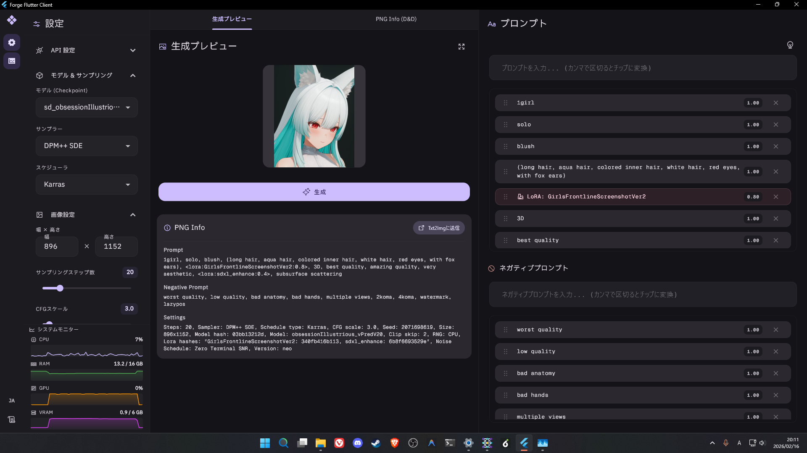
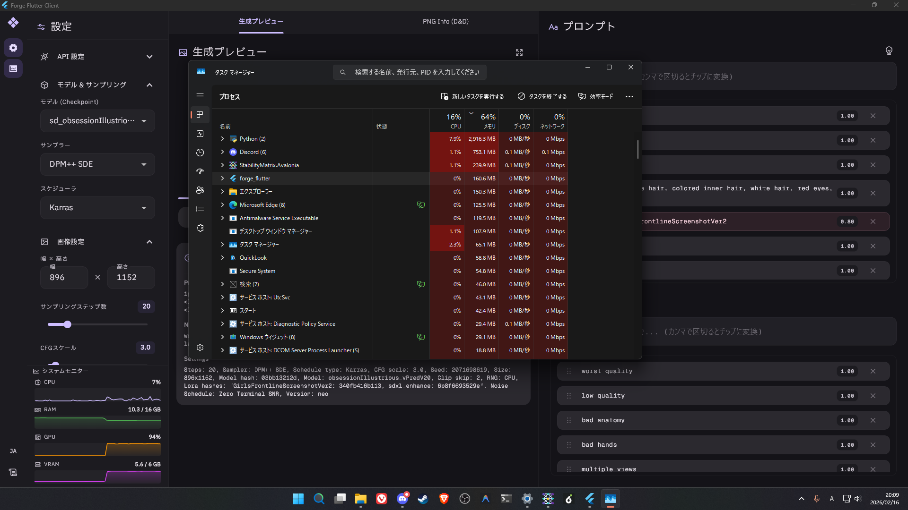

# Forge Flutter Client

**[English README](README.md)**

  

Forge Flutter Client は、[Forge Classic Neo](https://github.com/Haoming02/sd-webui-forge-classic) 用の超軽量デスクトップアプリケーションです。画像生成時のメモリ消費を極限まで抑えることをコンセプトに開発されています。

📸 <strong>スクリーンショット ギャラリー</strong> (クリックして展開)

|                             メイン画面                             |                                  メモリ使用量                                  |
| :----------------------------------------------------------------: | :----------------------------------------------------------------------------: |
|  |  |

## 概要

- **コンセプト:** Forge Classic Neo 用の超軽量デスクトップクライアント
- **目的:** 生成リソース確保のため、メモリ消費を最小限に抑える
- **パフォーマンス:**
  - **Forge Flutter Client:** 起動直後 約55MB / 生成中 約66MB / 生成直後 約80MB
  - **ブラウザ版 WebUI:** 起動直後 約300MB以上

## 主要機能

- **🚀 超軽量:** Flutter (Windows Native) 製。ブラウザを介さないため、VRAMやRAMの競合を最小限に抑制します。
- **🏷️ チップ形式プロンプト:** プロンプトをタグのように視覚的に管理。重み付けも直感的に操作でき、ドラッグ＆ドロップで並べ替え可能です。
- **🖼️ PNG Info連携:** 画像をドラッグ＆ドロップしてプロンプト情報を解析し、そのまま生成設定に反映できます。
- **📦 ポータブル:** インストール不要。`forge_flutter.exe` を実行するだけで動作します。

## 技術スタック

- **フレームワーク:** Flutter (Windows Native)
- **UIデザイン:** [Forui](https://forui.dev/) (ミニマリスティック Flutter UIライブラリ)
- **フォント:**
  - **UI:** IBM Plex Sans JP
  - **エディタ:** Geist Mono
- **ライセンス:** zlib License

## 開発の動機

既存の WebUI（Gradioベース）は多機能ですが、ブラウザ自体のメモリ消費が激しく、低・中スペックPCでの画像生成時にリソースを圧迫要因となります。
本プロジェクトは、「道具」としてよりサクサク動き、かつ洗練されたデザインの専用環境を提供することを目指しています。

## クイックスタート

初めての方は [クイックスタートガイド](docs/QUICKSTART.ja.md) をご覧ください。

> [!NOTE]
> 現在、プレビュー版バイナリは **Windows 版のみ** 提供しています。
> Linux / macOS をお使いの方はソースコードからビルドが必要です。

## コントリビューション

本プロジェクトは現在活発に開発中です。**0.x 系のバージョンは常に開発版（プレビュー版）として扱われ**、破壊的な変更が行われる可能性があります。皆様からのフィードバックやプロジェクトへの貢献を歓迎します。

- Issue でのバグ報告や機能提案
- プルリクエストによる改善
- ドキュメントや翻訳の修正

など、あらゆる貢献を歓迎します。詳細は [CONTRIBUTING.ja.md](CONTRIBUTING.ja.md) をご確認ください。
