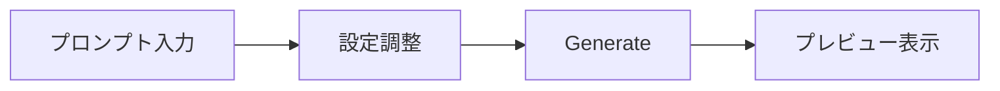

# クイックスタートガイド

Forge Flutter Client を使い始めるための手順を説明します。

> [!IMPORTANT]
> 本ガイドは **StabilityMatrix** から **Stable Diffusion WebUI Forge (Forge Classic Neo)** をインストールし、**API 経由** で接続する構成を前提としています。

---

## 前提条件

- **Windows 10/11**
- **StabilityMatrix** がインストール済みであること
- StabilityMatrix 経由で **Forge Classic Neo** がインストール済みであること
- 何らかの **Stable Diffusion モデル（.safetensors）** がダウンロード済みであること

---

## 1. Forge Classic Neo の API を有効にする

Forge Flutter Client は Forge の API を使って通信するため、Forge 側で API を有効にする必要があります。

### 手順

1. **StabilityMatrix を起動**し、左サイドバーの「パッケージ」を開く
2. Forge Classic Neo のパッケージを見つけ、**歯車アイコン（起動オプション）** をクリック
3. 「追加の引数」セクションで **`--api`** オプションを有効にする
   - チェックボックスがある場合はオンにする
   - 手動入力欄がある場合は `--api` と入力する
4. 設定を **保存** する
5. Forge Classic Neo を **起動**（または再起動）する

### APIの動作確認

Forge Classic Neo が起動したら、ブラウザで以下の URL にアクセスしてください：

```
http://127.0.0.1:7860/docs
```

Swagger UI が表示され、APIエンドポイントの一覧が確認できれば成功です。

> [!TIP]
> StabilityMatrix のデフォルトでは Forge Classic Neo は **ポート 7860** で起動します。
> ポートを変更している場合は、後述のアプリ設定で API URL を合わせてください。

---

## 2. Forge Flutter Client を取得する

### リリースビルドを使用する場合

1. [Releases ページ](https://github.com/nek9o/forge-flutter/releases) から最新の ZIP ファイルをダウンロード
2. 任意のフォルダに解凍
3. `forge_flutter.exe` を実行

### ソースからビルドする場合

```bash
# リポジトリをクローン
git clone https://github.com/nek9o/forge-flutter.git
cd forge-flutter

# 依存関係を解決
flutter pub get

# Windows 向けにビルド＆実行
flutter run -d windows
```

> [!NOTE]
> ソースからビルドするには [Flutter SDK](https://docs.flutter.dev/get-started/install) が必要です。

---

## 3. 初期設定

アプリを起動すると、左側にプロンプト入力、中央にプレビュー、右側に設定パネルが表示されます。

### API URL の設定

右側の設定パネルの上部に **API URL** の入力欄があります。

| 項目                           | 値                      |
| ------------------------------ | ----------------------- |
| デフォルト値                   | `http://127.0.0.1:7861` |
| Forge Classic Neo の標準ポート | `http://127.0.0.1:7860` |

> [!WARNING]
> アプリのデフォルト値（ポート `7861`）と Forge Classic Neo の標準ポート（`7860`）が異なる場合があります。
> Forge Classic Neo の起動ログに表示されるポート番号を確認し、必要に応じて API URL を修正してください。

接続に成功すると、設定パネルにモデル一覧やサンプラー一覧が自動的に読み込まれます。

### モデルの選択

設定パネルの「Model」セクションから使用するモデルを選択します。モデルの切り替えには数秒〜数十秒かかることがあります。

---

## 4. 画像を生成する

### 基本的な流れ



1. **プロンプトを入力** — 左側のプロンプトエディタにテキストを入力し、Enter キーまたはカンマで確定するとチップに変換されます
2. **設定を調整** — 右側のパネルで画像サイズ、ステップ数、CFG Scale などを設定
3. **「Generate」ボタンをクリック** — 画像生成が開始されます
4. **プレビューで確認** — 生成された画像が中央のプレビューエリアに表示されます

### プロンプトのチップ操作

| 操作                        | 説明                   |
| --------------------------- | ---------------------- |
| テキスト入力 → Enter/カンマ | チップに変換           |
| チップをダブルクリック      | プロンプトと重みを編集 |
| チップをドラッグ＆ドロップ  | 順番を入れ替え         |
| チップの × ボタン           | 削除                   |

### LoRA の追加

設定パネルの LoRA セクションから使用する LoRA を選択できます。選択すると、プロンプトに `<lora:名前:重み>` 形式のタグが自動的に追加されます。

---

## 5. PNG Info を使う

プレビューエリアの「PNG Info」タブに png 画像をドラッグ＆ドロップすると、画像に埋め込まれたメタデータ（プロンプト、設定値など）を確認できます。

「Send to txt2img」ボタンで、読み取ったメタデータをそのまま生成設定に反映することも可能です。

---

## トラブルシューティング

### 接続できない

| 確認事項                             | 対処法                                             |
| ------------------------------------ | -------------------------------------------------- |
| Forge Classic Neo は起動しているか？ | StabilityMatrix で起動状態を確認                   |
| API は有効か？                       | 起動オプションに `--api` があるか確認              |
| ポート番号は正しいか？               | Forge の起動ログでポートを確認し、API URL を修正   |
| ファイアウォール                     | セキュリティソフトが通信をブロックしていないか確認 |

### モデル一覧が表示されない

- Forge Classic Neo が完全に起動するまで待ってから、設定パネルを再読み込みしてください
- モデルファイル（`.safetensors`）が StabilityMatrix の models ディレクトリに配置されているか確認してください

### 画像が生成されない

- Forge Classic Neo のコンソールにエラーが出ていないか確認してください
- VRAM 不足の場合は、画像サイズを下げるか、ステップ数を減らしてください
