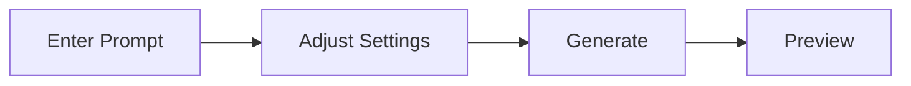

# Quick Start Guide

This guide walks you through getting started with Forge Flutter Client.

> [!IMPORTANT]
> This guide assumes you have installed **Stable Diffusion WebUI Forge (Forge Neo)** via **StabilityMatrix** and will connect via **API**.

---

## Prerequisites

- **Windows 10/11**
- **StabilityMatrix** installed
- **Forge Neo** installed via StabilityMatrix
- At least one **Stable Diffusion model (.safetensors)** downloaded

---

## 1. Enable Forge Neo API

Forge Flutter Client communicates with Forge via its API. You need to enable API access in Forge.

### Steps

1. Open **StabilityMatrix** and navigate to the "Packages" section in the sidebar
2. Find Forge Neo and click the **gear icon (Launch Options)**
3. In the "Additional Arguments" section, enable the **`--api`** option
   - Check the checkbox if available
   - Or manually type `--api` in the input field
4. **Save** the settings
5. **Launch** (or restart) Forge Neo

### Verify API Access

Once Forge Neo is running, open the following URL in your browser:

```
http://127.0.0.1:7860/docs
```

If you see the Swagger UI with a list of API endpoints, the API is working correctly.

> [!TIP]
> StabilityMatrix launches Forge Neo on **port 7860** by default.
> If you've changed the port, adjust the API URL in the app settings accordingly.

---

## 2. Get Forge Flutter Client

### Using a Release Build

1. Download the latest ZIP from the [Releases page](https://github.com/fal-114514/forge-flutter/releases)
2. Extract to any folder
3. Run `flutter_forge.exe`

### Building from Source

```bash
# Clone the repository
git clone https://github.com/fal-114514/forge-flutter.git
cd forge-flutter

# Install dependencies
flutter pub get

# Build and run for Windows
flutter run -d windows
```

> [!NOTE]
> Building from source requires the [Flutter SDK](https://docs.flutter.dev/get-started/install).

---

## 3. Initial Setup

When you launch the app, you'll see three panels: prompt editor (left), preview (center), and settings (right).

### API URL Configuration

The **API URL** input field is at the top of the settings panel.

| Item                    | Value                   |
| ----------------------- | ----------------------- |
| Default value           | `http://127.0.0.1:7861` |
| Forge Neo standard port | `http://127.0.0.1:7860` |

> [!WARNING]
> The app's default value (port `7861`) may differ from Forge Neo's standard port (`7860`).
> Check the port number shown in Forge's startup log and update the API URL if needed.

When connected successfully, the model list and sampler options will load automatically in the settings panel.

### Select a Model

Choose your model from the "Model" section in the settings panel. Switching models may take a few seconds.

---

## 4. Generate Images

### Basic Workflow



1. **Enter a prompt** — Type in the prompt editor and press Enter or comma to convert to chips
2. **Adjust settings** — Set image size, steps, CFG Scale, etc. in the settings panel
3. **Click "Generate"** — Image generation begins
4. **View preview** — The generated image appears in the center preview area

### Prompt Chip Operations

| Action              | Description            |
| ------------------- | ---------------------- |
| Type → Enter/Comma  | Convert to chip        |
| Double-click a chip | Edit prompt and weight |
| Drag & drop chips   | Reorder                |
| Click × on a chip   | Delete                 |

### Adding LoRA

Select a LoRA from the LoRA section in the settings panel. A `<lora:name:weight>` tag will be automatically added to your prompt.

---

## 5. Using PNG Info

Drag and drop a PNG image onto the "PNG Info" tab in the preview area to view embedded metadata (prompt, settings, etc.).

Click "Send to txt2img" to apply the extracted metadata directly to your generation settings.

---

## Troubleshooting

### Cannot Connect

| Check                 | Solution                                               |
| --------------------- | ------------------------------------------------------ |
| Is Forge Neo running? | Check its status in StabilityMatrix                    |
| Is the API enabled?   | Verify `--api` is in the launch options                |
| Is the port correct?  | Check Forge's startup log and update the API URL       |
| Firewall              | Ensure security software isn't blocking the connection |

### Model List Not Loading

- Wait for Forge Neo to fully start, then refresh the settings panel
- Verify model files (`.safetensors`) are in StabilityMatrix's models directory

### Image Generation Fails

- Check Forge Neo's console for errors
- If VRAM is insufficient, reduce image size or lower the step count
